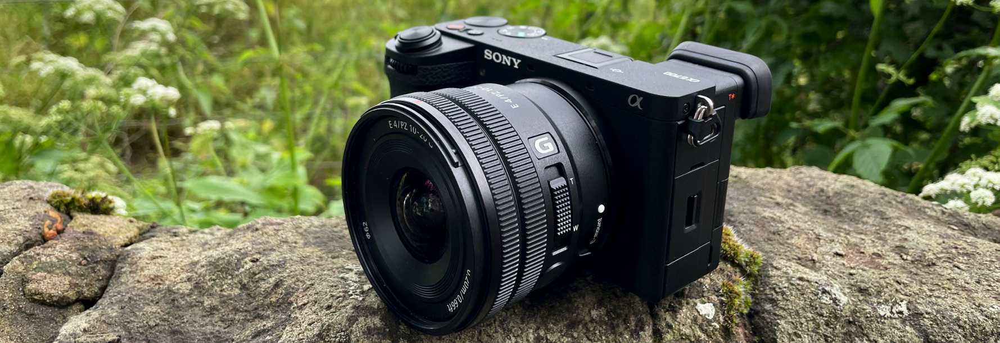

---

A friend once told me, "photography is objective," and he wasn’t wrong. Investing in a "professional" camera can be a costly adventure. As the joke goes:

> "The best way to make money in photography is by selling your equipment" – [Casually Explained: Photography](https://youtu.be/tJrr3FAtf1U?si=Tzl7-LxpU5wY8BQc)

The type of photography you pursue plays a big role in deciding what camera and lenses are right for you. For anyone just starting, I’d recommend the **Sony A6700**. It strikes a nice balance—offering some guidance for beginners without the complexity or bulk of higher-end models.

Here’s a quick overview of types of photos:

- **Macro**: Ideal for detailed close-ups, like insects or toy photography. This one is the one that I focus more.
- **Portraits**: Perfect for capturing people, whether in street photography or formal portraits.
- **Wildlife**: Best for shooting animals in nature, often requiring a telephoto lens for distant subjects.
- **Landscape**: Great for capturing wide, scenic views like mountains, oceans, or city skylines. Typically, a wide-angle lens works best for these shots to include as much of the scene as possible.

My general advice would be to avoid spending on new gear unless you're feeling limited by the camera you already have with you all the time—your phone. Honestly, some of my most popular photos were taken on my phone, making up about 50% of them. Personally, I care a lot about being able to zoom in and capture every detail because, for me, blur or lack of detail can break the immersion.

But guess what? Many people don’t even mind! As long as you're happy with the results, that's what really matters.

---

 

# Quick Tips

- **Noise is your enemy**: Always be mindful of noise in low-light situations. Reducing ISO or using noise reduction software can help mitigate this issue.

 

## Applications

And even before considering buying a camera, get familiar with Apps like Lightroom, there are other options but in my personal experience, it simpler to use the free mobile version and get to tweak photos on the go.

From my approach, it's basically 20% the camera and 80% the edition.

 

## Exposure triangle

When shooting in automode it balances the Exposure, which is the amount of light that it receives. But to be able to adapt and use the best setting, you will need to understand how to keep the balance between the different controls that allow the light to be processed by the camera:

- Aperture: the control over the opening of the lens, the bigger the more light it will have. The downside is that the depth of focus will change. In short, more open, more light, but less things in focus.
- Shutter Speed: the amount of time that the sensor receives light. More time, more light. The downsize is that taking more time will require a tripod or better pulse, and to shot moving targets you can't take much time or things will look blurry.
- ISO: the "artificial" increase of the light. It's useful, but it may cause noise in your photos.

Now, all of that information is to keep the balance in your light sensor (0), which means that your photo won't be overexposed or underexposed.

The concept of stops is the one that you get familiar with to take balance it out. In short, if you compensate light by increasing something (+2) from one or both parts of the triangle you will need to decrease accordingly (-2).

- [Exposure Definition: Understanding photography exposure](https://capturetheatlas.com/what-is-exposure-in-photography/)
- [The Exposure Triangle in Photography Explained for Beginners](https://capturetheatlas.com/exposure-triangle-explained-photography/)
- 
- 

 
 

## Bad Light

Mastering challenging lighting conditions is crucial for any photographer.
From the video [YT - Get GREAT PHOTOS in BAD LIGHT!](https://youtu.be/9ro-kLqbhdA?si=GBJln3Av_8ims3AX) here is the summary of the advises:

- **Slow down that shutter**: When light is scarce, let more in by increasing exposure time.
  - Tripod is your best friend: It's essential for sharp images at slow shutter speeds.
  - Self-timer or remote: Eliminate camera shake from pressing the shutter button.
  - Be mindful of motion: Even slight movements can cause blur, so choose your subjects wisely.

- **Embrace wide apertures**: Think of your lens as a light funnel – the wider, the better.
  - Play with depth: A wide-open aperture creates a shallow depth of field, perfect for isolating subjects.
  - Focus stacking trick: For more depth, take multiple shots at different focus points and blend in post.

- **Shape the light**: Don't just accept the light you're given – create it!
  - Portable flash: A game-changer for adding punch to your subject.
  - Reflectors are magic: Bounce existing light to fill shadows and add dimension.
  - LED panels: Continuous light sources give you real-time control over your scene.

There is not bad light, only more opportunities to be creative.

 

# My Camera

I use the Sony Alpha 6700, a mirrorless camera that offers many advantages over traditional DSLR cameras:
- **Weight and Size**: Smaller and lighter than DSLRs.
- **Live View**: Real-time exposure and focus through the electronic viewfinder.
- **Faster Shooting**: Improved autofocus and shooting speed.

Now, if you ask me what I get from that, is that it is relative cheap **2400-3000 USD** depending on where you buy it and with what lens.

 

## Setup

For automatic settings:
- **Auto-menu setup**: The Alpha 6700 has customizable menus where you can assign your most-used functions, speeding up your workflow.
- Limitations: Understanding battery life and overheating in continuous shooting are important considerations for long shoots.

 

## Lens Nomenclature

- The lens nomenclature for Sony lenses can be tricky. Here's a quick guide:
  - **E-mount**: Sony’s lens mount for APS-C and full-frame cameras.
  - **FE**: Denotes full-frame compatibility.
  - **T***: Zeiss T* coating for improved image quality by reducing reflections.

 

## Recommended Lenses

To be honest, I don't have a lot of experience with lenses, but I do recommend the same that I use:

- **[Zeiss T* FE 55mm f/1.8](https://www.kenrockwell.com/sony/zeiss/55mm-f18.htm)**:
  - [Review Video](https://youtu.be/4MtIRKqhWaY?si=_VlW4AI_ilmS8icd)
    - Excellent performance in low-light situations.
    - Minimum focusing distance of 50 cm.
    - A wonderful thing for detailed pictures of objects.

You can use the [dxomark](https://www.dxomark.com/Lenses/) site to compare lenses.

 

## Lens Maintenance

Yes, you have to do it. There a cheap kits available but try to go for the ones that appear more professional. After all you will be cleaning a 800 USD lens, so you don't want to mess up.

1. **Start with a blower**: give the lens a good puff of air with a lens blower to get rid of dust.
2. **Brush it off**: If there's still dust, use a soft brush to gently sweep it away. Be careful not to press too hard.
3. **Wipe with microfiber**: Always use a clean microfiber cloth. Wipe in gentle circles from the center out. No need for pressure—let the cloth do the work.
4. **For smudges, use lens cleaner**: For fingerprints or greasy spots, dab a bit of lens cleaner onto the cloth (not the lens directly) and gently clean.
5. **Lens wipes work too**: Pre-moistened lens wipes are a quick and easy option for when you're on the go.
6. **Avoid household cleaners**: Keep the Windex away! Stick to products made for camera lenses.
7. **If you use a filter**: Clean your lens filter the same way. It’s easier to replace a scratched filter than a lens.

# Resources

- [dxomark](https://www.dxomark.com/Lenses/): Great resource for camera lens rankings and technical reviews.

 